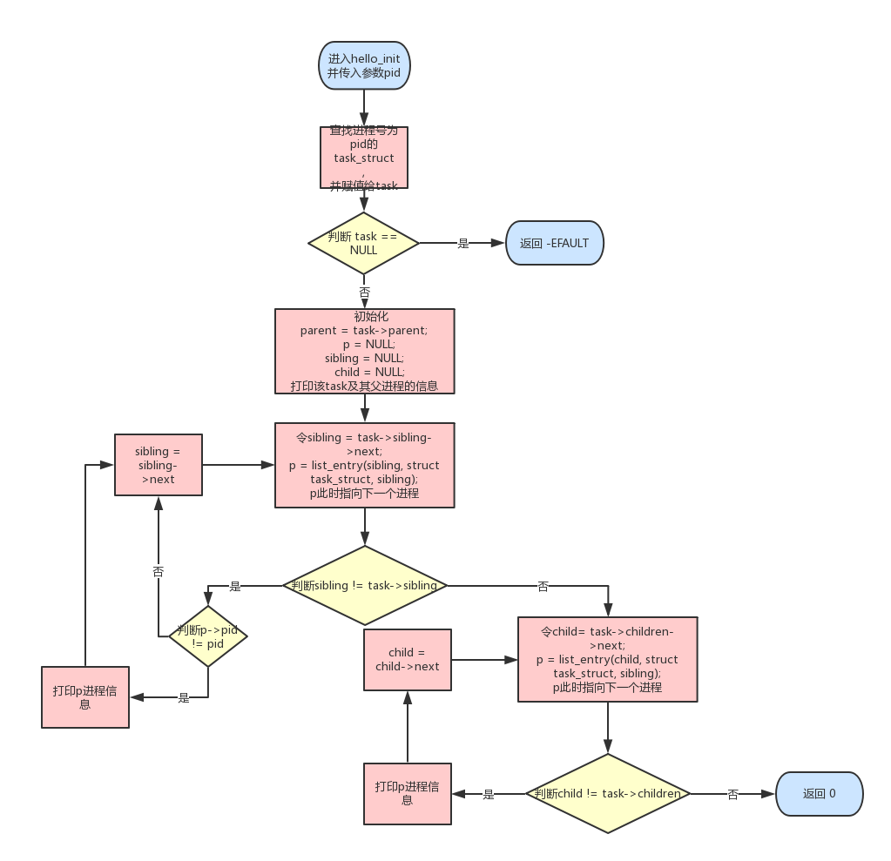

# linux 内核模块编程

## 项目设计方案

### 总体设计思路

设计一个模块，要求列出系统中所有内核线程的程序名、PID号、进程状态及进程优先级：

* 查找task_struct结构体相应的字段 task->comm, task->pid, task->state, task->prio。
* 因为需要列出系统所有进程的情况，所以需要遍历进程树。

设计一个带参数的模块，其参数为某个进程的PID号，该模块的功能是列出该进程的家族信息，包括父进程、兄弟进程和子进程的程序名、PID号：

* 声明一个pid参数，使用相应的内核函数来获得相应的进程结构体，再由此获得父进程，然后需要遍历父进程的子进程和该进程的子进程
* 2次遍历的思路基本是一致的，这里需要用到内核里提供的嵌入式链表结构。

### 接口设计

严格按照实验指导手册给定的接口设计

### 主要函数程序设计思路与程序设计流程图




### 设计方案创新性分析

嵌入式链表的使用很新颖，这种链表就像继承一样，可以在许多需要链式结构存储的结构体使用。
进程树便时如此，通过`list_entry`可以找到结构体内任意成员，这里时找到需要打印的数据。
而通过`list_for_each`让进程拥有链表的遍历特性。

## 项目实现过程

### 遇到的问题

* 嵌入式链表的函数许多时实际是用宏实现的，参数跟平时编程时候完全不同，跟普通的函数有比较大的差别，所以使用起来感觉很奇怪而非常不适应，理解也比较困难。根据老师的课程设计书和自己的参考资料，可以加深对嵌入式链表的理解和运用。
* 编写带参数的模块时，忘记参数传入，导致一直实现不如预期。最后仔细检查内核模块的开发流程才解决问题。
* Makefile 配置需要仔细检查，需要去学习一下基本的makefile语法，才能更好地完成实验。
* 需要为参数设置权限，所以要注意 module_param 这个函数。

### 分析程序运行结果

* 第一个模块，能成功打印出大量进程的信息，而且以进程号递增的顺序打印出来，大多数进程的优先级为100或120。
* 第二个模块，需要传入正确的pid，否则会报错。该模块可以打印出正确的信息，但是pid=1时，init进程也有兄弟进程，

### 分析程序实现中的创新性

使用了list来遍历进程，可以更灵活地控制。题目整体要求很明确，没有太多可以自由发挥的地方。
使用task->mm == NULL来找出内核线程，因为内核线程没有自己独立的地址空间。

## 进一步思考

### 分析程序性能

* 第一个模块性能较差，因为要找到所有的内核线程，只能遍历整个进程树。
* 第二个模块性能也较差，先根据pid找到相应的task_struct，然后遍历其子节点和其父节点的子节点。

### 考虑的改进思路

暂时没有想到更快的方案，可能时间复杂度已经最优，局部可以再优化。

### 你认为教师对本实验的设计是否合理？难易程度如何？有什么改进建议？

该实验对内核模块编程有一定的要求，并且对make的使用需要有一定的了解。
这个实验对C/C++编程很有帮助，因为makefile对C/C++编程非常有帮助，这让同学们接触到了makefile。
难度合理，且在学习进程知识过程中开始编程，有助于加深进程知识的理解。
改进建议是，第一个模块和第二个模块实验太相近，而难度是递增的，可以修改第一个模块的实验内容，
这样可以考察不同的知识点。

## 参考文献

* [Linux内核设计与实现(原书第3版)](https://book.douban.com/subject/6097773/)
* https://github.com/jijiwuming/HDU-OS-Experiment
* http://blog.csdn.net/decisiveness/article/details/45915679
* http://blog.csdn.net/zbh19921021/article/details/49019335

## 程序完整代码


```C
// first
#include <linux/module.h>
#include <linux/init.h>
#include <linux/kernel.h>
#include <linux/sched.h>
#include <linux/init_task.h>

MODULE_LICENSE("GPL");

static int hello_init(void)
{
    struct task_struct *task;

    for (task = &init_task; (task = next_task(task)) != &init_task;)
    {
        // kernel thread
        if (task->mm == NULL)
        {
            printk(KERN_ALERT "名称:%s\n进程号:%d\n状态:%ld\n优先级:%d\n",
            task->comm, task->pid, task->state, task->prio);
        }
    }
    return 0;
}

static void hello_exit(void)
{
    printk(KERN_ALERT "good bye thread-iteration\n");
}

module_init(hello_init);
module_exit(hello_exit);

```


```C
// sencond
#include <linux/module.h>
#include <linux/init.h>
#include <linux/kernel.h>
#include <linux/sched.h>
#include <linux/init_task.h>
#include <linux/moduleparam.h>
#include <linux/pid.h>
#include <linux/list.h>

MODULE_LICENSE("GPL");

static int pid;
module_param(pid, int, 0755);

static int hello_init(void)
{
    struct task_struct *task = pid_task(find_vpid(pid), PIDTYPE_PID);
    if(task == NULL){
        printk(KERN_ALERT "bad pid\n");
        return -EFAULT;
    }
    struct task_struct *parent = task->parent;
    struct task_struct *p = NULL;

    struct list_head *sibling = NULL;
    struct list_head *child = NULL;

    printk(KERN_ALERT "父进程:%s,pid:%d\n", parent->comm, parent->pid);
    printk(KERN_ALERT "该进程:%s,pid:%d\n", task->comm, task->pid);

    /** 
    * list_for_each - iterate over a list
    * @pos: the &struct list_head to use as a loop cursor.
    * @head: the head for your list.
    */
    list_for_each(sibling, &task->sibling)
    {
        /** 
        * list_entry - get the struct for this entry
        * @ptr: the &struct list_head pointer.
        * @type: the type of the struct this is embedded in.
        * @member: the name of the list_head within the struct.
        */
        p = list_entry(sibling, struct task_struct, sibling);
        if (p->pid != pid)
        {
            printk(KERN_ALERT "兄弟进程:%s,pid:%d\n", p->comm, p->pid);
        }
    }

    list_for_each(child, &task->children)
    {
        p = list_entry(child, struct task_struct, sibling);
        printk(KERN_ALERT "子进程:%s,pid:%d\n", p->comm, p->pid);
    }

    return 0;
}

static void hello_exit(void)
{
    printk(KERN_ALERT "good bye process-family-info\n");
}

module_init(hello_init);
module_exit(hello_exit);
```